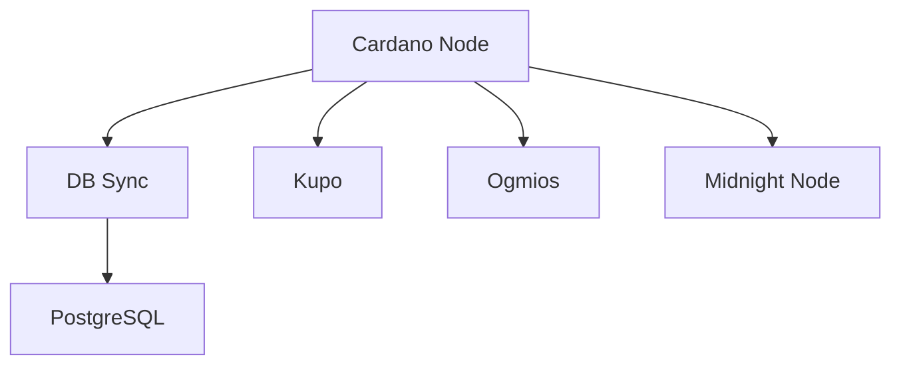

# Midnight Node Architecture

## System Overview
The system consists of several interconnected services:

1. **Cardano Node**
   - Primary blockchain node
   - Socket Path: `/ipc/node.socket`
   - Network: Preview testnet

2. **DB Sync**
   - Indexes blockchain data
   - PostgreSQL backend
   - Memory Configuration: 4G limit, 2G reservation

3. **Kupo**
   - UTXO indexer
   - Tracks chain tip
   - Database location: `/db`

4. **Ogmios**
   - JSON-RPC interface
   - WebSocket API
   - Chain sync client

5. **Midnight Node**
   - Privacy-focused sidechain
   - ZK-proof capabilities
   - Integration with Cardano main chain

## Service Dependencies

## Network Configuration
- All services share network `partner-chain-net`
- Socket communication via `/ipc/node.socket`
- Health checks configured for all services

## Resource Management
- PostgreSQL: 4G memory limit, 2G reservation
- DB Sync: 4G memory limit, 2G reservation
- Snapshot management for quick recovery
- Regular backup system

## Security Considerations
- Socket permissions strictly controlled
- Volume mounts properly configured
- Network isolation between services
- Secure configuration management

## Monitoring
- Health check endpoints
- Resource usage monitoring
- Sync progress tracking
- Error logging and alerting
